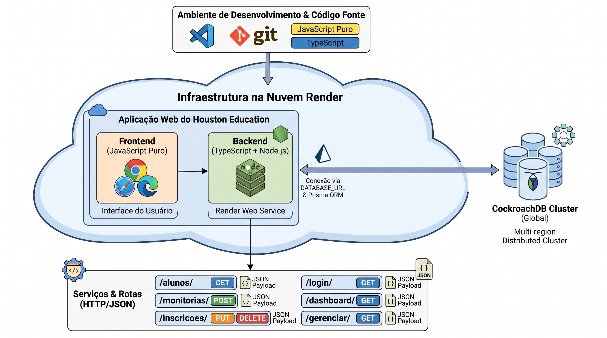

# Software Requirements Specification
## For Houston Education

Version 1.5.2
Prepared by Henrique — Desenvolvedor 
UniCEUB — Centro Universitário de Brasília
2026-06-30

## Table of Contents
<!-- TOC -->
* [1. Introduction](#1-introduction)
    * [1.1 Document Purpose](#11-document-purpose)
    * [1.2 Product Scope](#12-product-scope)
    * [1.3 Definitions, Acronyms, and Abbreviations](#13-definitions-acronyms-and-abbreviations)
    * [1.4 References](#14-references)
    * [1.5 Document Overview](#15-document-overview)
* [2. Product Overview](#2-product-overview)
    * [2.1 Product Perspective](#21-product-perspective)
    * [2.2 Product Functions](#22-product-functions)
    * [2.3 Product Constraints](#23-product-constraints)
    * [2.4 User Characteristics](#24-user-characteristics)
    * [2.5 Assumptions and Dependencies](#25-assumptions-and-dependencies)
    * [2.6 Apportioning of Requirements](#26-apportioning-of-requirements)
* [3. Requirements](#3-requirements)
    * [3.1 External Interfaces](#31-external-interfaces)
    * [3.2 Functional](#32-functional)
    * [3.3 Quality of Service](#33-quality-of-service)
    * [3.4 Compliance](#34-compliance)
    * [3.5 Design and Implementation](#35-design-and-implementation)
    * [3.6 AI/ML](#36-aiml)
* [4. Verification](#4-verification)
* [5. Appendixes](#5-appendixes)

OBS: Esse documento usa o padrão da IEE 830, forkado do repositório: https://github.com/jam01/SRS-Template/blob/master/srs-template-bare.md
<!-- TOC -->

## 1. Introduction
<!-- overview of the SRS: purpose, scope, audience, and organization of the document; avoid detailed requirements -->

Este documento é a Especificação de Requisitos de Software (SRS) do sistema **Houston Education**, elaborado conforme o padrão **IEEE 830**. Ele consolida, em um único artefato, as necessidades de negócio, a visão geral do produto e os requisitos funcionais e não funcionais que orientam o desenvolvimento, a verificação e a evolução da aplicação.

### 1.1 Document Purpose
<!-- why this SRS exists, its intended audiences, and how they'll use it; keep to 2–4 sentences and avoid implementation detail -->

O objetivo deste documento é expor as necessidades e funcionalidades gerais da aplicação, definindo seu propósito principal, sua razão de existência, os requisitos funcionais do sistema e as tecnologias empregadas. Destina-se à equipe de desenvolvimento, aos professores e avaliadores do Projeto Integrador. 

### 1.2 Product Scope
<!-- the product (name/version), its primary purpose, key capabilities, and boundaries. keep brief and focus on the "what" and "why", not the "how" -->

O **Houston Education** (versão 1.5.2) é uma aplicação web capaz de exibir as monitorias existentes no contexto do UniCEUB, permitir a inscrição dos alunos nessas monitorias e possibilitar a criação e atualização de monitorias por monitores e administradores. A principal ideia é ser simples: com poucos cliques, o usuário principal (aluno) pode se inscrever na monitoria que deseja participar e acompanhar suas atividades. O sistema sana o cenário problemático da ausência de um espaço virtual público e de fácil acesso para visualização das monitorias da universidade, sendo o único local da instituição que centraliza visualização, inscrição, adição e atualização de monitorias. Estão fora do escopo a realização das sessões de monitoria em si (videoconferência) e a integração com sistemas acadêmicos oficiais da instituição.

### 1.3 Definitions, Acronyms, and Abbreviations
<!-- glossary of domain terms, acronyms, and abbreviations; keep entries alphabetized -->

| Term | Definition |
|------|------------|
| ADMIN | Perfil de administrador do sistema, com acesso total à gestão de entidades e auditoria. |
| ALUNO | Perfil padrão de usuário; estudante que visualiza e se inscreve em monitorias. |
| ATA | Registro textual associado a uma monitoria, editável após o início da sessão. |
| Auditoria | Registro cronológico das ações relevantes realizadas no sistema. |
| BRT | Brasília Time (UTC−3), fuso horário em que os horários das monitorias são tratados. |
| bcrypt | Algoritmo de hash de senhas utilizado para armazenamento seguro de credenciais. |
| CockroachDB | Banco de dados SQL distribuído, compatível com PostgreSQL, usado em produção. |
| CRUD | Create, Read, Update, Delete — operações básicas sobre entidades. |
| Inscrição | Vínculo entre um aluno e uma monitoria, indicando participação. |
| JWT | JSON Web Token — token usado para autenticação e autorização. |
| Monitor | Aluno apto a ministrar monitorias; perfil com permissões de gestão das próprias monitorias. |
| Monitoria | Sessão de reforço/ tutoria por pares, vinculada a disciplina, local e horário. |
| MVC | Model-View-Controller — padrão arquitetural em camadas (Controller → Service → Repository). |
| ORM | Object-Relational Mapping — mapeamento objeto-relacional (Prisma). |
| Pepper | Segredo adicional concatenado à senha antes do hash, para reforço de segurança do admin. |
| Perfil | Papel do usuário no sistema (ADMIN, MONITOR ou ALUNO). |
| SRS | Software Requirements Specification — este documento. |
| UniCEUB | Centro Universitário de Brasília, contexto institucional da aplicação. |

### 1.4 References
<!-- normative and informative external sources; include title, owner, version, date, location/URL, and whether it is normative or informative -->

| Título | Responsável | Versão/Data | Localização | Tipo |
|--------|-------------|-------------|-------------|------|
| IEEE Std 830-1998 — Recommended Practice for Software Requirements Specifications | IEEE | 1998 | ieee.org | Normativa |
| Documento Houston Education (MainDoc) | Equipe do Projeto Integrador | 2026 | `docs/MainDoc.md` | Normativa |
| Changelog Houston Education | Equipe do Projeto Integrador | 1.5.2 / 2026-06-21 | `docs/CHANGELOG.md` | Informativa |
| Keep a Changelog | keepachangelog.com | 1.0.0 | https://keepachangelog.com/pt-BR/1.0.0/ | Informativa |
| Semantic Versioning | semver.org | 2.0.0 | https://semver.org/lang/pt-BR/ | Normativa |
| Mapa do Ensino Superior 2026 | Semesp / INEP | 2026 | semesp.org.br | Informativa |
| Visible Learning (meta-análise sobre tutoria por pares) | John Hattie | 2023 | — | Informativa |
| Documentação Prisma ORM | Prisma | 6.x | https://www.prisma.io/docs | Informativa |
| Documentação Express | OpenJS Foundation | 4.x | https://expressjs.com | Informativa |
| Documentação Render | Render | — | https://render.com/docs | Informativa |

### 1.5 Document Overview
<!-- document structure and conventions -->

O documento está organizado em cinco seções, conforme o padrão IEEE 830. A **Seção 1** apresenta o propósito, o escopo e o glossário. A **Seção 2** descreve a visão geral do produto (perspectiva, funções, restrições, usuários e premissas). A **Seção 3** detalha os requisitos: interfaces externas, requisitos funcionais (identificados por `RF-NN`), qualidade de serviço, conformidade, projeto/implementação e IA/ML. A **Seção 4** apresenta a matriz de verificação dos requisitos, e a **Seção 5** reúne os apêndices (diagramas e referências internas).

## 2. Product Overview
<!-- background and context that shape the product's requirements -->

O setor de ensino superior em Tecnologia da Informação e Comunicação (TIC) vive um paradoxo: enquanto o número de matrículas cresceu 10,5% recentemente, a taxa de desistência acumulada na rede privada chegou a 64,7%, segundo o Mapa do Ensino Superior 2026 (Semesp/INEP). Uma das principais causas é a dificuldade dos alunos em disciplinas críticas de base nos primeiros semestres, agravada pela descentralização e informalidade dos processos de monitoria (grupos de mensagens e murais físicos). O Houston Education nasce dessa oportunidade: digitalizar e centralizar o processo, criando um canal oficial que conecta quem precisa aprender com quem está apto a ensinar.

### 2.1 Product Perspective
<!-- context of the system: a new product, a replacement, or part of a family; note relationships to other systems -->

O Houston Education é um produto novo e independente, do tipo aplicação web, desenvolvido como Projeto Integrador no contexto do UniCEUB. Não substitui um sistema legado nem faz parte de uma família de produtos pré-existente. Esse projeto tem fito único de ser acadêmico. 

### 2.2 Product Functions
<!-- major functional areas or features the product provides in 5–10 concise bullets -->

- Cadastro de usuários e sua respectiva autenticação.
- Visualização de monitorias disponíveis.
- Inscrição e cancelamento de inscrição dos alunos em monitorias.
- Criação, atualização e exclusão de monitorias por monitores e administradores.
- Gestão de presença (chamada) dos alunos, com exportação de presentes para PDF.
- Histórico de monitorias por monitor e visão geral para o administrador.
- Painel administrativo (dashboards) para gestão de usuários, locais, disciplinas e cursos.
- Auditoria das ações relevantes do sistema como todas descritas acima.
- Expiração automática de monitorias após sua realização.
- Gestão de perfil do usuário (dados pessoais e alteração de senha).

### 2.3 Product Constraints
<!-- design and implementation constraints that affect the solution -->

- O front-end **não utiliza frameworks** — é construído com HTML, CSS e JavaScript puro (ES modules).
- O back-end segue arquitetura MVC em camadas: Controller → Service → Repository.
- A linguagem de implementação é TypeScript, executada sobre Node.js com Express.
- A persistência é feita via Prisma ORM sobre CockroachDB.
- Os horários das monitorias devem ser tratados no fuso de **Brasília (BRT, UTC−3)**, independentemente do fuso do servidor.
- A aplicação está hospedada no Render por escolha pessoal da equipe de desenvolvimento
- Não há restrições de linguagem, frameworks, integrações ou uso de aplicativos terceiros para hospedagem ou qualquer outro fito.
- O projeto não conta com investimento de capital interno ou externo, sendo todas as dependências de aplicativos ou soluções totalmente gratuitas.

### 2.4 User Characteristics
<!-- classes, roles, expertise, access levels, frequency of use, and accessibility or localization needs -->

| Perfil | Descrição | Nível de acesso | Frequência |
|--------|-----------|-----------------|------------|
| **Aluno (ALUNO)** | Estudante de graduação que enfrenta dificuldades em disciplinas específicas e busca auxílio extra. Espera-se familiaridade básica com aplicações web. | Visualizar monitorias, inscrever-se/cancelar, gerenciar próprio perfil. | Alta |
| **Monitor (MONITOR)** | Aluno que organiza e ministra monitorias, pode ser escolhido por um professor específico ou não ( Isso não afeta no seu uso ou sequer é relevante para a aplicação). | Criar/atualizar/excluir as próprias monitorias, registrar presença, ver histórico. | Média |
| **Administrador (ADMIN)** | Responsável pela gestão da plataforma e dos dados institucionais. | Acesso total: gestão de usuários, locais, disciplinas, cursos, todas as monitorias e auditoria. | Baixa/Média |

### 2.5 Assumptions and Dependencies
<!-- assumptions about environment, third-party services, usage patterns, and other external factors; note potential impact/risk. -->

#### Assumptions:
- Acesso: Assume-se que o usuário tenha um navegador instalado no seu computador ou dispositivo móvel.
- Conectividade: É necessário o uso de internet para acesso ao site.

#### Dependencies:

- **Runtime:** Disponibilidade de Node.js e do framework Express.
- **Banco de dados:** Instância CockroachDB acessível via `DATABASE_URL`.
- **Variáveis de ambiente:** Presença de `JWT_SECRET`, `DATABASE_URL`, `ADMIN_PASSWORD` e `ADMIN_PASSWORD_PEPPER`.
- **Hospedagem:** O serviço Render permanece disponível e dentro dos limites do plano e instância do CockroachDB funcional. 
- **CDNs externos:** Font Awesome, flatpickr e Phosphor Icons disponíveis.
- **Serviço de testes:** Qase.io acessível para reporte de testes em CI. 

### 2.6 Apportioning of Requirements
<!-- map major requirements to subsystems, services, or releases/iterations -->

| Subsistema / Release | Requisitos atendidos |
|----------------------|----------------------|
| **Autenticação & Usuários** (v1.0.0, v1.2.0, v1.4.0) | Login JWT, cadastro, perfil, alteração de senha, pepper do admin. |
| **Monitorias** (v1.0.0, v1.1.0, v1.4.0, v1.5.0, v1.5.2) | CRUD de monitorias, conflito de horário, ATA, atribuição automática de monitor, expiração via cron, exclusão restrita. |
| **Inscrições & Presença** (v1.0.0, v1.3.0) | Inscrição/cancelamento, chamada de presença, exportação PDF. |
| **Catálogo (Cursos/Disciplinas/Locais/Campus)** (v1.0.0, v1.1.0) | CRUD e associação N:N Disciplina↔Curso. |
| **Administração & Auditoria** (v1.1.0, v1.3.0, v1.5.0, v1.5.2) | Dashboards admin, auditoria de eventos com filtros. |
| **Qualidade & Infra** (v1.0.0, v1.5.0) | CI/CD GitHub Actions, testes E2E (Selenium) e de performance (k6). |

## 3. Requirements
<!-- identifiable, verifiable, testable requirements; avoid implementation details -->

### 3.1 External Interfaces
<!-- inputs/outputs (formats, protocols, timing, etc); reference interface schemas where available. -->

A comunicação cliente-servidor ocorre via **HTTP/HTTPS** com payloads em **JSON**. As validações de entrada são feitas com **Yup** (com `noUnknown` para rejeitar campos não permitidos). A autenticação trafega via cabeçalho `Authorization: Bearer <token>` ou cookie HTTP-only `token`.

#### 3.1.1 User Interfaces
<!-- user interactions (UI elements, dialogs, flows); reference design/style guides -->

As interfaces são páginas HTML servidas a partir de `public/pages/`, com CSS em `public/style/` e scripts em `public/scripts/`. As principais telas são:
- `login.html` e `cadastro.html` — autenticação e registro.
- `home.html` — listagem de monitorias agrupadas por curso, com alternância entre campus.
- `gerenciarMonitorias.html` — gestão de monitorias (abas "Agendadas" e "Antigas"), detalhes, chamada e exclusão.
- `perfil.html` — edição de dados pessoais e alteração de senha.
- `dashboardAdmin.html` dashboards de usuários, locais, disciplinas, cursos e auditoria.
- `naoAutorizado.html` — página de acesso negado personalizada.

Recursos de UX incluem máscara no campo de matrícula, date/time picker (flatpickr), ícones (Font Awesome/Phosphor) e transições nativas (`view-transition`).

#### 3.1.2 Hardware Interfaces
<!-- interactions with physical devices (types, signals, etc) -->

Não aplicável. O sistema não interage diretamente com dispositivos de hardware específicos além do equipamento cliente padrão (computador ou smartphone com navegador web).

#### 3.1.3 Software Interfaces
<!-- integrations with other systems (APIs, contracts, owner, etc) -->

- **API REST interna:** endpoints sob `/alunos`, `/monitorias`, `/inscricoes`, `/disciplinas`, `/locais`, `/campus`, `/cursos`, `/auditorias`, `/login`, `/home`, `/logout`.
- **Banco de dados:** CockroachDB acessado via Prisma Client (`DATABASE_URL`).
- **Autenticação:** JWT assinado com `JWT_SECRET` (`jsonwebtoken`).
- **Hospedagem:** Render (aplicação web) e CochroachDB (banco remoto).
- **Reporte de testes:** Qase.io (`QASE_API_TOKEN`, `QASE_PROJECT_CODE`).

### 3.2 Functions
<!-- externally observable behaviors organized by feature/use case -->

**Autenticação e Usuários**
- **RF-01** O sistema deve permitir que um visitante se cadastre como aluno informando nome, e-mail, matrícula e senha, rejeitando e-mail ou matrícula já existentes.
- **RF-02** O sistema deve autenticar o usuário via e-mail e senha, retornando um JWT.
- **RF-03** O sistema deve permitir ao usuário atualizar seus dados pessoais (nome, e-mail, matrícula), impedindo o envio de campos vazios.
- **RF-04** O sistema deve permitir ao usuário alterar a própria senha mediante endpoint dedicado, exigindo confirmação de senha.
- **RF-05** O sistema deve permitir ao ADMIN criar, atualizar e excluir usuários, impedindo a auto-exclusão.

**Monitorias**
- **RF-06** O sistema deve listar as monitorias disponíveis, agrupadas por curso e filtráveis por campus.
- **RF-07** O sistema deve permitir a monitores e administradores criar monitorias, atribuindo automaticamente o monitor autor.
- **RF-08** O sistema deve impedir a criação/atualização de monitoria com horário de fim menor ou igual ao de início.
- **RF-09** O sistema deve impedir a existência de duas monitorias no mesmo local e horário (conflito), exceto a própria monitoria em atualização.
- **RF-10** O sistema deve permitir a edição do campo ATA somente após o início da monitoria.
- **RF-11** O sistema deve permitir a exclusão de uma monitoria apenas pelo monitor autor ou pelo ADMIN.
- **RF-12** O sistema deve expirar automaticamente as monitorias após sua realização, por meio de rotina agendada (a cada 10 minutos).

**Inscrições e Presença**
- **RF-13** O sistema deve permitir que um aluno se inscreva em uma monitoria, impedindo inscrições duplicadas.
- **RF-14** O sistema deve impedir o cancelamento de inscrição após o início da monitoria.
- **RF-15** O sistema deve permitir ao monitor (ou ADMIN) registrar a presença dos inscritos somente após o início da sessão.
- **RF-16** O sistema deve permitir exportar a lista de alunos presentes em PDF.
- **RF-17** O sistema deve exibir ao aluno suas inscrições ("Minhas Inscrições"), incluindo o curso da monitoria.

**Catálogo e Administração**
- **RF-18** O sistema deve oferecer CRUD de cursos, disciplinas, locais e campus, com nomes únicos para curso e disciplina.
- **RF-19** O sistema deve permitir associar uma disciplina a nenhum, um ou vários cursos (relação N:N).
- **RF-20** O sistema deve disponibilizar dashboards administrativos para a gestão das entidades, restritos ao ADMIN.

**Auditoria**
- **RF-21** O sistema deve registrar em auditoria os eventos de criação/atualização/exclusão de monitoria, login, criação/atualização/exclusão de aluno, alteração de senha e criação/remoção de inscrição.
- **RF-22** O sistema deve permitir ao ADMIN consultar os registros de auditoria, ordenados do mais recente e filtráveis por dia.

### 3.3 Quality of Service
<!-- measurable non-functional attributes section -->

#### 3.3.1 Performance
<!-- time (latency, throughput, etc.) and space (memory, storage, bandwidth, etc.) -->

- **RNF-01** O sistema deve ser submetido a testes de performance com **k6** nas modalidades smoke, load, stress, soak e spike, executados em ambientes local e de produção.
- **RNF-02** Os testes de smoke de login e de monitorias devem ser executados na pipeline de CI a cada integração.
- **RNF-03** As páginas principais (home, login) devem responder de forma fluida em conexões e dispositivos típicos de estudantes, incluindo dispositivos móveis.

#### 3.3.2 Security
<!-- protection of data, identities, and operations (transit/rest, auth, encryption, etc); safety, confidentiality, privacy, integrity, and availability -->

- **RNF-04** As senhas devem ser armazenadas com hash **bcrypt** (custo 10); jamais em texto puro.
- **RNF-05** A senha do administrador deve receber um **pepper** adicional (variável de ambiente) antes do hash.
- **RNF-06** A autenticação deve usar **JWT** com expiração de 2 horas; o token em cookie deve ser `httpOnly`, `sameSite: strict` e `secure` em produção.
- **RNF-07** O acesso a recursos deve ser controlado por **autorização baseada em perfil** (ADMIN, MONITOR, ALUNO).
- **RNF-08** Todas as entradas devem ser validadas por schemas Yup com `noUnknown`, rejeitando campos não permitidos.
- **RNF-09** As respostas que expõem dados de aluno devem retornar apenas campos úteis e seguros, sem expor a senha.

#### 3.3.3 Reliability
<!-- ability to consistently perform as specified (MTBF, redundancy/failover, caches, etc) -->

- **RNF-10** As regras de negócio (conflito de horário, unicidade de inscrição, validação de datas) devem ser aplicadas de forma consistente, garantindo a integridade dos dados.
- **RNF-11** O uso de CockroachDB (banco distribuído) provê tolerância a falhas e replicação no ambiente de produção.

#### 3.3.4 Availability
<!-- readiness to deliver service (target SLAs, maintenance windows, recovery/restore, etc) -->

- **RNF-12** A aplicação deve estar disponível continuamente por meio da hospedagem no Render, sujeita às janelas de manutenção e características do plano contratado.
- **RNF-13** A recuperação de dados depende das políticas de backup do provedor de banco de dados (CockroachDB/Render).

#### 3.3.5 Observability
<!--  logs, metrics, traces, alerting and dashboards -->

- **RNF-14** O sistema deve manter uma trilha de **auditoria** persistente (tabela `Auditoria`) das ações relevantes, com ator, ação, entidade, identificador e detalhes.
- **RNF-15** A pipeline de CI deve reportar os resultados de teste ao Qase.io.

### 3.4 Compliance
<!-- laws, standards, contracts, or policies; cite the authority and verifiable criteria. -->

- **RNF-16** O tratamento de dados pessoais (nome, e-mail, matrícula) deve observar os princípios da **LGPD (Lei nº 13.709/2018)**, expondo apenas dados necessários e protegendo credenciais.
- **RNF-17** O versionamento do projeto deve seguir o **Semantic Versioning (SemVer)**.
- **RNF-18** O registro de mudanças deve seguir o formato **Keep a Changelog**.

### 3.5 Design and Implementation
<!-- constraints and mandates on design, deployment, and maintenance section -->

#### 3.5.1 Installation
<!-- ensure software runs smoothly in its target environments (supported platforms, prerequisites, configuration, etc) -->

Pré-requisitos: Node.js e acesso a uma instância CockroachDB que pode ser criada através de uma imagem do Docker. Passos: definir as variáveis de ambiente (`.env` a partir de `.env.example`); instalar dependências (npm install); executar `npx prisma generate` e `prisma migrate deploy`; popular o banco com `tsx prisma/seed.ts`; iniciar com `npm run dev` (desenvolvimento) ou `npm start` (produção, após `npm run build`).

#### 3.5.2 Build and Delivery
<!-- controls for building and delivering (dependency management, automation, integrity/traceability, etc) -->

O build é feito com `npx prisma generate && tsc`. As dependências são gerenciadas via npm (`package.json`/lockfile). A entrega é automatizada por **GitHub Actions** (CI/CD), com jobs separados de build e smoke tests, rodando também uma instância do cockroachDB para os testes.

#### 3.5.3 Distribution
<!-- distributed deployments, data, and devices (topologies, replication/placement, etc) -->

A aplicação é distribuída como serviço web único no **Render**. O **CockroachDB** disponibiliza um cluster para administração de um banco de dados remoto.

#### 3.5.4 Maintainability
<!-- measurable attributes that make the software easier to modify, fix, and evolve (modularity, standards, documentation, observability, etc) -->

- Arquitetura modular em camadas (Controller → Service → Repository) com separação por domínio.
- Tipagem estática com TypeScript.
- Baixo acomplamento entre funções e classes.
- Documentação viva: CHANGELOG e esse SRS.

#### 3.5.5 Reusability
<!-- components intended for reuse -->

Middlewares (`autenticado`, `autorizado`, `validateSchema`), utilitários (JWT, pepper, parse de datas BRT), schemas Yup e o padrão Repository são projetados para reutilização entre os diferentes domínios da aplicação.

#### 3.5.6 Portability
<!-- ability to run on multiple environments (supported OSs/runtimes, cloud providers, etc) -->

Por ser uma aplicação Node.js com banco compatível com o protocolo PostgreSQL, o sistema é portável entre sistemas operacionais (Windows, Linux, macOS) e provedores de nuvem. O front-end roda em qualquer navegador moderno.

#### 3.5.7 Cost
<!-- targets/budgets that influence design or implementation (cloud spend, per-transaction, licensing, etc) -->

O projeto prioriza tecnologias open-source e planos gratuitos/econômicos de hospedagem (Render) e banco de dados (cockroachDB), mantendo o custo operacional baixo, compatível com um Projeto Integrador acadêmico.

#### 3.5.8 Deadline
<!-- milestones, delivery dates, and readiness criteria -->

Marcos entregues: v1.0.0 (2026-04-28, primeira versão oficial), v1.1.0 (2026-04-30), v1.2.0 (2026-05-08), v1.3.x (2026-05-21), v1.4.0 (2026-05-25), v1.5.x (2026-06). O projeto possui sua versão final sendo a 1.5.2, versão essa que foi apresentada no dia 29/06/2026 para a banca avaliadora da premiação de projetos integradores indicados a cerimônia.

#### 3.5.9 Proof of Concept
<!-- objectives, scope, timebox, and success criteria for any POC -->

A versão **1.0.0** funcionou como poc: CRUD das entidades principais, autenticação JWT, arquitetura MVC e deploy no Render. Critério de sucesso atingido: aluno consegue se cadastrar, autenticar, visualizar e se inscrever em monitorias.

#### 3.5.10 Change Management
<!-- how changes are introduced and communicated (categories, required artifacts and workflow, etc) -->

As mudanças são introduzidas via branches (`main` para produção, `dev` para desenvolvimento contínuo), versionadas por SemVer e documentadas no `CHANGELOG.md` com as categorias *Added, Changed, Deprecated, Removed, Fixed, Security*.

### 3.6 AI/ML
<!-- ML-specific requirements section -->

**Não aplicável.** O Houston Education, na versão 1.5.2, não possui componentes de Inteligência Artificial ou Machine Learning em seu core, seu uso foi exclusivo para desenvolvimento contínuo. As subseções a seguir são mantidas para conformidade com o padrão imposto e poderão ser preenchidas caso recursos de IA/ML sejam incorporados em versões futuras.

#### 3.6.1 Model Specification
Não aplicável.

#### 3.6.2 Data Management
Não aplicável.

#### 3.6.3 Guardrails
Não aplicável.

#### 3.6.4 Ethics
Não aplicável.

#### 3.6.5 Human-in-the-Loop
Não aplicável.

#### 3.6.6 Model Lifecycle and Operations
Não aplicável.

## 4. Verification

| Requirement ID | Verification Method | Test/Artifact Link | Status | Evidence |
|----------------|---------------------|--------------------|--------|----------|
| RF-02 | Teste E2E (Selenium) + smoke (k6) | `test:e2e` (login), smoke de login | Verificado | Pipeline CI / Qase.io |
| RF-06 | Teste E2E (Selenium) + smoke (k6) | smoke de monitorias | Verificado | Pipeline CI / Qase.io |
| RF-07, RF-08, RF-09 | Teste E2E + inspeção | `test:e2e` (monitoria) | Verificado | Execução de testes |
| RF-13 | Teste E2E (Selenium) | `test:e2e` (inscrição) | Verificado | Execução de testes |
| RF-11 | Inspeção / teste manual | Regra autor/ADMIN no service | Verificado | Revisão de código (v1.5.2) |
| RF-21, RF-22 | Inspeção / teste manual | Tela de auditoria | Verificado | Registros na tabela `Auditoria` |
| RNF-01 | Teste de performance (k6) | scripts smoke/load/stress/soak/spike | Verificado | Relatórios k6 |
| RNF-04, RNF-06 | Inspeção de código | bcrypt + JWT/cookie | Verificado | Revisão de código |

## 5. Appendixes

**Apêndice A — Diagrama de Arquitetura**

**Apêndice B — Diagrama Entidade-Relacionamento (ERD)**
O ERD completo é gerado automaticamente a partir do schema do Prisma e está disponível em `prisma/erd.svg`. Ele ilustra as entidades Aluno, Monitoria, Inscricao, Disciplina, Curso, DisciplinaCurso, Local, Campus, Perfil e Auditoria, com seus atributos e relacionamentos.

**Apêndice C — Histórico de mudanças**
O registro detalhado de alterações por versão está em `docs/CHANGELOG.md`.